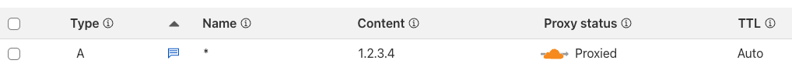

# tools.kup.tz Request Logger Worker

> [!IMPORTANT]  
> Even though this is a standalone worker, it shares a database with [tools.kup.tz](https://github.com/tino-kuptz/tools.kup.tz) in prod
> The scheme in this project was imported into the prod database of tools.kup.tz, too, so in case you want to setup both combined together you need to import it in tools.kup.tz, too.

A Cloudflare Worker that logs all requests to any subdomain under `397625878.xyz` (and localhost for testing) to a D1 database.

## Features

- Logs requests to all subdomains under `397625878.xyz`
- Strips Cloudflare-specific headers before logging
- Records host, headers, body, timestamp, IP address, method, URL, and user agent
- Logs the real connecting IP address
- Supports localhost for testing
- Automatic cleanup of old records (older than 3 days) via daily cron job

## Setup

## In Cloudflare
For this worker to work you need to setup a wildcard record with cf proxying enabled.

</img>

Otherwise your worker wont receive the requests.

### Initial setup

```bash
npm install
npm run db:create
```

This will create a new D1 database and output the database ID. Copy this ID and update the `database_id` in `wrangler.toml`.

### Setup local or remote db

```bash
# Setup local database
npm run db:migrate:dev
# Setup prod database
npm run db:migrate:prod
```

## Development

### Local Development

Quick start after cloning this repo
```bash
npm install
npm run db:create
# Replace the uuid in wrangler.jsonc
npm run db:migrate:dev
npm run dev
```

This will start a local development server that responds to `*.localhost` requests.

### Database Shell

```bash
npm run db:shell
```

## Database Schema

The worker logs the following data to the `http_request_logs` table:

- `id`: Auto-incrementing primary key
- `host`: The subdomain (e.g., "demo01", "localhost")
- `headers`: JSON string of HTTP headers (Cloudflare headers stripped)
- `body`: Raw request body
- `timestamp`: ISO timestamp of the request
- `ip`: Real IP address of the client
- `method`: HTTP method (GET, POST, etc.)
- `url`: Full request URL
- `user_agent`: User agent string
- `created_at`: Database insertion timestamp

## Usage Examples

```sh
# Test with a subdomain
curl -X POST "https://demo01.397625878.xyz/test" \
  -H "Content-Type: application/json" \
  -d '{"test": "data"}'

# Test with localhost (development)
curl -X GET "http://demo01.localhost:8787/test" \
  -H "Custom-Header: test-value"
```

## Project Structure

The codebase is organized into modular utilities:

- `src/utils/headers.js` - Header manipulation (stripping Cloudflare headers, IP extraction)
- `src/utils/cloudflare.js` - Cloudflare-specific utilities (subdomain extraction, request processing)
- `src/utils/database.js` - Database wrapper with methods for logging, querying, and cleanup

## Configuration

### Environment Variables

The worker uses the following environment configuration in `wrangler.jsonc`:

- `DB`: D1 database binding for storing logs
- Production routes: `*.397625878.xyz/*`
- Development routes: `*.localhost/*`

### Customization

You can modify the worker behavior by editing the utility files:

- `src/utils/headers.js` - Change header processing logic
- `src/utils/cloudflare.js` - Modify subdomain extraction or request data preparation
- `src/utils/database.js` - Add new database queries, modify logging behavior, or change cleanup retention period
- `src/index.js` - Change the main request flow, response format, or scheduled tasks

### Scheduled Tasks

The worker includes a scheduled function that runs daily at midnight UTC:

- **Automatic Cleanup**: Deletes records older than 3 days to prevent database bloat
- **Configurable**: Modify the retention period in `src/index.js` (currently set to 3 days)
- **Logging**: All cleanup operations are logged to the console

## Security Notes

- The worker strips Cloudflare-specific headers
- All requests are logged regardless of method or content

## Troubleshooting

### Common Issues

1. **Database not found**: Ensure you've created the D1 database and updated the ID in `wrangler.jsonc`
2. **Migration errors**: Run `npm run db:migrate` to apply the schema
3. **Deployment failures**: Check that your Cloudflare account has Workers and D1 enabled

### Logs

Check the Cloudflare Workers dashboard for runtime logs and errors.
