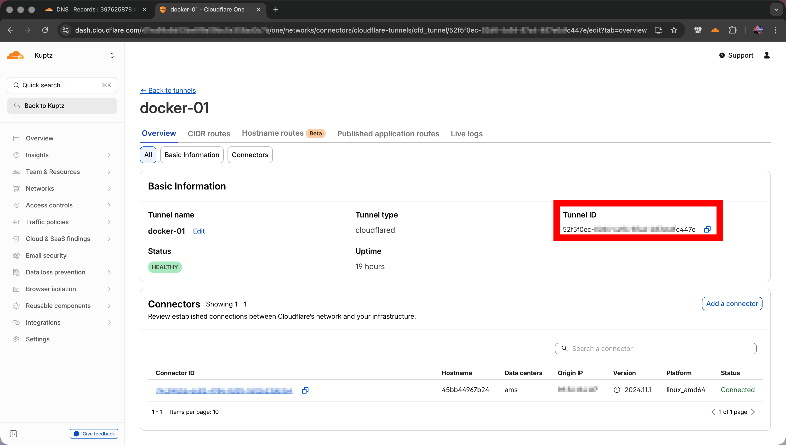
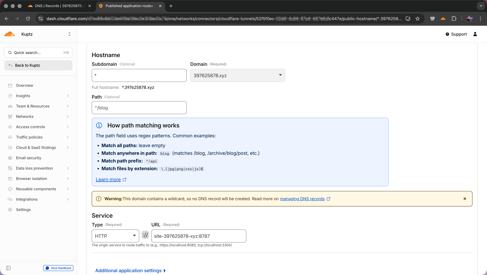
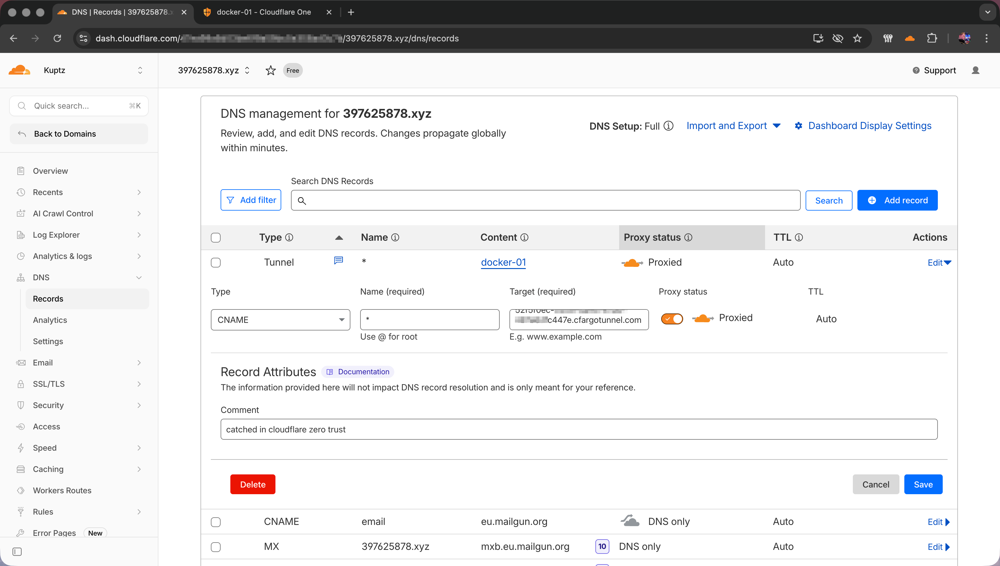

# 397625878.xyz request logger

A small Node.js HTTP server that records every request in PostgreSQL.

## Features

- Accepts only hosts matching `<uuid>.${BASE_DOMAIN}` (RFC 4122 UUID); the `host` column stores **only** the UUID
- Logs headers (proxy-forwarding headers omitted from the stored JSON; IP is stored separately), body, request time, client IP, method, URL, and user agent
- Client IP from `X-Forwarded-For` / `X-Real-IP` when present, otherwise the socket address
- CORS headers on responses (same behavior as the previous worker)
- Loads `.env` automatically via [dotenv](https://github.com/motdotla/dotenv) (variables already set in the shell still win)

## Configuration

### Cloudflare

In Cloudflare setup a tunnel, and fetch it's uuid.  
Configure a wildcard application route to this container (in this case `*.397625878.xyz` -> `http://internal-container-name:8787`).  
As wildcard routes do not generate a dns record in Cloudflare, create the wildcard record manually pointing to `<tunnel-uuid>.cfargotunnel.com`

   

Afterwards all requests going to <code>*.397625878.xyz</code> will be routed through your tunnel to your local container.

### Container

PostgreSQL is read from environment variables (including those in `.env`):

| Variable | Example |
|----------|---------|
| `POSTGRES_HOST` | `localhost` |
| `POSTGRES_PORT` | `5432` |
| `POSTGRES_USER` | `postgres_user` |
| `POSTGRES_PASSWORD` | `postgres_pass` |
| `POSTGRES_DB` | `postgres_db` |
| `BASE_DOMAIN` | `397625878.xyz` | Requests must use `Host: <uuid>.<BASE_DOMAIN>` (port allowed in `Host`) |

Optional:

| Variable | Default | Description |
|----------|---------|-------------|
| `PORT` | `8787` | HTTP listen port |

## Run

```bash
npm install
cp .env.example .env
# edit .env with your credentials
npm start
```

You can still use plain `export` / systemd / Docker env instead of `.env`; the server does not require a `.env` file.

Development with auto-restart on file changes:

```bash
npm run dev
```

## Database schema

See https://github.com/tino-kuptz/tools.kup.tz/blob/main/db.sql

## Project layout

- `src/index.js` — HTTP server
- `src/utils/database.js` — PostgreSQL pool and insert
- `src/utils/request.js` — body read, URL build, row shaping
- `src/utils/headers.js` — IP resolution and header filtering for logs

## Usage examples

With `BASE_DOMAIN=localhost` in `.env`:

```sh
curl -X POST "http://550e8400-e29b-41d4-a716-446655440000.localhost:8787/test" \
  -H "Content-Type: application/json" \
  -d '{"test": "data"}'
```

Put the app behind a reverse proxy that sets `X-Forwarded-For` / `X-Forwarded-Proto` if you terminate TLS in front of it.

## Security notes

- Every request path and body is persisted; do not expose the database broadly.
- Tune body size in `src/utils/request.js` if you need a different limit.
